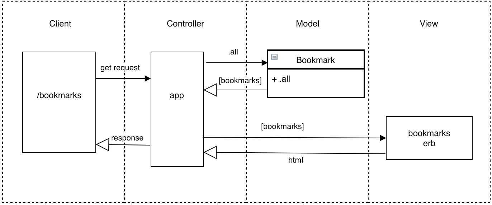

## Bookmark Manager

### Project Requirements:

The following user stories serve as the product specifications:

#### User Story One
```
As a user  
So I can know what bookmarks I have  
I would like to show a list of bookmarks
```

#### User Story Two
```
As a user
So that I can save things I'm interested in
I would like to add to my list of bookmarks
```

#### User Story Three
```
As a user
So that I can manage my interests
I would like to delete a bookmark from my list
```

#### User Story Four
```
As a user
So that I can change an individual link
I would like to be able to update bookmarks
```

#### User Story Five
```
As a user
So that I can better manage my bookmarks
I would like to be able to tag bookmarks
```

#### User Story Six
```
As a user
So that I can refine my search
I would like to be able to filter by tag
```

#### User Story Seven
```
As a user
So I can manage my own set of bookmarks
I would like to have a list that is mine
```


## Domain Model



## Setting up your database

Connect to `psql` and create `bookmark_manager` database:

```
CREATE DATABASE bookmark_manager;
```

To setup tables, connect to the database in `psql` and run the SQL scripts in `db/migrations`

### Running the Bookmark Manager app

```
rackup -p 9292
```

View bookmarks by navigating to `localhost:3000/bookmarks`.
